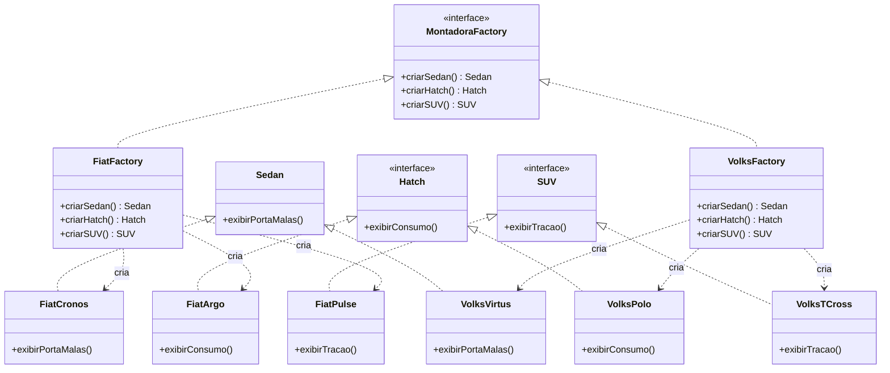

# Atividade: Padrões de Projeto (Factory Method e Abstract Factory)

**Integrantes da Dupla:** Ana Beatriz Novais Pereira | Isabelle 

---

## Diagrama de Classes - Abstract Factory 

```mermaid
classDiagram
    class MontadoraFactory {
        <<interface>>
        +criarSedan() Sedan
        +criarHatch() Hatch
        +criarSUV() SUV
    }

    class FiatFactory {
        +criarSedan() Sedan
        +criarHatch() Hatch
        +criarSUV() SUV
    }

    class VolksFactory {
        +criarSedan() Sedan
        +criarHatch() Hatch
        +criarSUV() SUV
    }

    class Sedan {
        <interface>
        +exibirPortaMalas()
    }

    class Hatch {
        <<interface>>
        +exibirConsumo()
    }

    class SUV {
        <<interface>>
        +exibirTracao()
    }

    class FiatCronos { +exibirPortaMalas() }
    class FiatArgo { +exibirConsumo() }
    class FiatPulse { +exibirTracao() }

    class VolksVirtus { +exibirPortaMalas() }
    class VolksPolo { +exibirConsumo() }
    class VolksTCross { +exibirTracao() }

    MontadoraFactory <|.. FiatFactory
    MontadoraFactory <|.. VolksFactory

    Sedan <|.. FiatCronos
    Sedan <|.. VolksVirtus

    Hatch <|.. FiatArgo
    Hatch <|.. VolksPolo

    SUV <|.. FiatPulse
    SUV <|.. VolksTCross

    FiatFactory ..> FiatCronos : cria
    FiatFactory ..> FiatArgo : cria
    FiatFactory ..> FiatPulse : cria

    VolksFactory ..> VolksVirtus : cria
    VolksFactory ..> VolksPolo : cria
    VolksFactory ..> VolksTCross : cria
```
